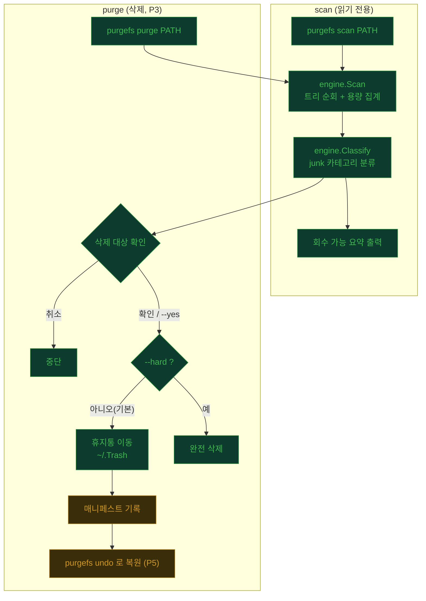

# PurgeFs

macOS·Linux용 빠른 터미널 디스크 클리너. 경로를 스캔해 용량을 잡아먹는 junk를 찾고, 안전하게 정리한다. GUI 없음, 유료 없음.

[tw93/mole](https://github.com/tw93/mole)에서 영감을 받아 집중된 CLI로 다듬었다. 삭제는 기본적으로 **휴지통행**(복구 가능)이며, 완전 삭제는 `--hard`로만.

## 진행 상황


| 단계 | 내용 | 상태 |
|------|------|------|
| P1 | 스캔 엔진 (트리 순회·용량 집계·`scan`) | ✅ 완료 |
| P2 | 룰 시스템 (junk 분류·회수량 미리보기) | ✅ 완료 |
| P3 | 휴지통 + `purge` (삭제, 확인 후) | ✅ 완료 |
| P4 | TUI (대화형 선택) | ✅ 완료 |
| P5 | `undo` 복원 + 개발자 프리셋 | 🚧 예정 |

## 서비스 플로우



## 빌드

Go(1.24+) 필요.

```bash
# Go 없으면 설치
brew install go

go build -o purgefs .
./purgefs --help
```

빌드 없이 실행:

```bash
go run . scan ~/Downloads
```

## 사용법

```bash
purgefs scan [PATH]                    # PATH(기본 .) 아래 junk 보고, 삭제 안 함
purgefs purge [PATH] [--yes] [--hard]  # junk 삭제. 기본 휴지통, --yes 확인 생략, --hard 완전 삭제
purgefs purge [PATH] -i                # 대화형 TUI로 항목 골라 정리
```

`scan` 출력 예:

```
Scanned /path/to/project
Total: 1.4 GB across 812 files, 143 dirs
  1.2 GB  /path/to/project/node_modules
  ...

Reclaimable: 1.2 GB across 2 categories
     1.2 GB  node_modules    (1 item)
       3 KB  os-junk         (2 items)
```

## 구조

```
main.go                진입점
cmd/                   cobra 커맨드 (root, scan, purge)
  scan.go              scan: 스캔 + 요약 출력
  purge.go             purge: 분류 + 확인 + 삭제 (runPurge, guardRoot)
  format.go            humanBytes / plural
internal/engine/
  walk.go              Walker: 순회 + 용량 집계
  scan.go              Scan: Report 생성
  rule.go              Rule 인터페이스 + 내장 규칙
  classify.go          Classify: 카테고리 그룹핑
  model.go             Entry / Report / CategoryGroup
internal/trash/
  trash.go             Trasher: 휴지통 이동 / 완전 삭제
internal/tui/
  model.go             bubbletea 선택 모델 (체크박스·용량 막대)
```

## 안전 원칙

- 스캔 루트 **밖**은 절대 삭제하지 않는다.
- 심볼릭링크는 따라가지 않는다(링크 자체만, 대상 삭제 금지).
- 기본은 휴지통행(복구 가능). 완전 삭제는 `--hard`로만, 별도 확인.
- `scan`은 본질적으로 미리보기(dry-run). `purge`는 삭제 전 확인.

## 라이선스

MIT — [LICENSE](LICENSE) 참고.
