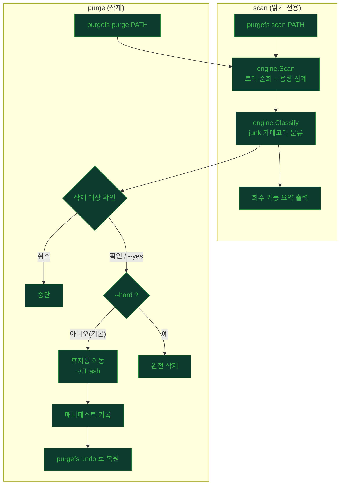
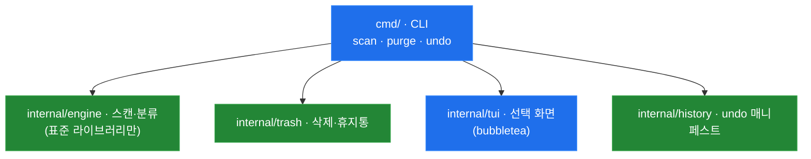

# PurgeFs

macOS·Linux용 빠른 터미널 디스크 클리너. 경로를 스캔해 용량을 잡아먹는 junk를 찾고, 안전하게 정리한다. GUI 없음, 유료 없음.

삭제는 기본적으로 **휴지통행**(복구 가능)이며, 완전 삭제는 `--hard`로만.

## 진행 상황


| 단계 | 내용 | 상태 |
|------|------|------|
| P1 | 스캔 엔진 (트리 순회·용량 집계·`scan`) | ✅ 완료 |
| P2 | 룰 시스템 (junk 분류·회수량 미리보기) | ✅ 완료 |
| P3 | 휴지통 + `purge` (삭제, 확인 후) | ✅ 완료 |
| P4 | TUI (대화형 선택) | ✅ 완료 |
| P5 | `undo` 복원 + 개발자 프리셋 | ✅ 완료 |

## 서비스 플로우



## 빌드

Go(1.24+) 필요.

```bash
# Go 없으면 설치
brew install go

go build -o purgefs .
./purgefs --help
```

빌드 없이 실행:

```bash
go run . scan ~/Downloads
```

## 명령어

| 명령 | 하는 일 |
|------|---------|
| `purgefs scan [PATH]` | PATH 아래 junk를 찾아 용량·카테고리 요약 출력 (삭제 안 함) |
| `purgefs purge [PATH]` | 감지된 junk 삭제 (기본 휴지통, 확인 후) |
| `purgefs undo` | 가장 최근 휴지통 purge를 되돌린다 |
| `purgefs completion <shell>` | 셸 자동완성 스크립트 생성 (bash·zsh·fish·powershell) |
| `purgefs help [명령]` | 명령 도움말 |

전역 플래그: `-h, --help` 도움말 · `-v, --version` 버전.

### `scan` — 읽기 전용 스캔

PATH(기본: 현재 디렉토리)를 순회해 용량 큰 항목과 회수 가능한 junk 카테고리를 보여준다. **아무것도 삭제하지 않는다.**

```bash
purgefs scan              # 현재 디렉토리
purgefs scan ~/Downloads  # 특정 경로
```

출력 예:

```text
Scanned /path/to/project
Total: 1.4 GB across 812 files, 143 dirs
  1.2 GB  /path/to/project/node_modules
  ...

Reclaimable: 1.2 GB across 2 categories
     1.2 GB  node_modules    (1 item)
       3 KB  os-junk         (2 items)
```

### `purge` — 정리(삭제)

감지된 junk를 삭제한다. 기본은 macOS 휴지통(복구 가능)으로 옮기며, 삭제 전 확인한다.

| 플래그 | 설명 |
|--------|------|
| `--yes` | 확인 프롬프트 생략 (스크립트·자동화용) |
| `--hard` | 휴지통이 아니라 **완전 삭제** (복구 불가) |
| `-i, --interactive` | TUI로 항목을 직접 골라 정리 |
| `--preset <이름>` | 규칙 프리셋으로 대상 좁힘 (`dev-caches`: 빌드·의존성 캐시만) |

```bash
purgefs purge ~/project                    # 확인 후 휴지통으로
purgefs purge ~/project --yes              # 확인 없이 휴지통으로
purgefs purge ~/project --hard             # 완전 삭제 (복구 불가)
purgefs purge ~/project -i                 # 대화형 TUI로 선택
purgefs purge ~/project --preset dev-caches # node_modules·빌드 캐시만 (.DS_Store 제외)
```

위험 루트는 거부한다: `/`, 홈 디렉토리와 그 조상(`/Users` 등), 시스템 디렉토리(`/usr`, `/etc`, `/var` 등). 이들을 가리키는 심볼릭링크도 막는다.

`build/`·`dist/`·`target/`은 이름만으로 빌드 산출물인지 알 수 없으므로, 같은 위치에 프로젝트 마커가 있을 때만 대상이 된다 — `target/`은 `Cargo.toml`·`pom.xml`, `dist/`는 `package.json`, `build/`는 `build.gradle`·`pom.xml`·`CMakeLists.txt`. `node_modules/`·`__pycache__/`·`.gradle/`·`.DS_Store`는 이름만으로 명확해 마커가 필요 없다.

### `undo` — 되돌리기

가장 최근 휴지통 purge를 되돌린다. purge가 남긴 매니페스트(`~/.purgefs/history`)를 읽어 휴지통에서 원래 자리로 파일을 복원한다.

```bash
purgefs undo   # 마지막 휴지통 정리를 복원
```

원래 자리에 이미 뭔가 있으면 덮어쓰지 않고 건너뛴다. `--hard`(완전 삭제)는 기록이 없어 되돌릴 수 없다.

되돌린 매니페스트는 소비되므로, `undo`를 다시 실행하면 그 이전 purge로 넘어간다. 복원에 실패한 항목이 있으면 매니페스트를 남겨 원인을 고친 뒤 다시 시도할 수 있다.

`-i` 대화형 화면:

```text
정리할 항목 선택 (↑/↓ 이동, space 토글, enter 실행, q 취소)

> [x] node_modules      1.2 GB ████████████████████
  [x] build-cache      340 MB █████░░░░░░░░░░░░░░░░░
  [x] os-junk            3 KB ░░░░░░░░░░░░░░░░░░░░░░

선택 합계: 1.5 GB
```

## 구조

프론트엔드(CLI·TUI)는 엔진에 의존하고, 엔진은 그 반대를 모른다. 이 단방향 경계 덕분에 나중에 다른 프론트엔드(예: GUI)를 얹기 쉽다.



```text
purgefs/
├─ main.go                  진입점 → cmd.Execute()
├─ cmd/                     cobra 커맨드 (프론트엔드)
│  ├─ root.go              루트 커맨드 · 버전
│  ├─ scan.go              scan: 스캔 + 요약 출력
│  ├─ purge.go             purge: 분류 · 확인 · 삭제 (runPurge · guardRoot · -i · --preset)
│  ├─ undo.go              undo: 최근 매니페스트 복원
│  └─ format.go            humanBytes · plural
└─ internal/
   ├─ engine/               스캔·분류 (표준 라이브러리만)
   │  ├─ walk.go           Walker: 순회 + 용량 집계
   │  ├─ scan.go           Scan: Report 생성
   │  ├─ rule.go           Rule 인터페이스 + 내장 규칙
   │  ├─ classify.go       Classify: 카테고리 그룹핑
   │  └─ model.go          Entry · Report · CategoryGroup
   ├─ trash/                삭제·휴지통
   │  └─ trash.go          Trasher: 휴지통 이동 / 완전 삭제 (+ 원본→목적지 매핑)
   ├─ history/              undo 매니페스트
   │  └─ history.go        Save · LoadLatest · Restore
   └─ tui/                  대화형 선택 (bubbletea)
      └─ model.go          선택 모델 (체크박스 · 용량 막대)
```

## 안전 원칙

- 스캔 루트 **밖**은 절대 삭제하지 않는다.
- 심볼릭링크는 따라가지 않는다(링크 자체만, 대상 삭제 금지).
- 기본은 휴지통행(복구 가능). 완전 삭제는 `--hard`로만, 별도 확인.
- `scan`은 본질적으로 미리보기(dry-run). `purge`는 삭제 전 확인.

## 라이선스

MIT — [LICENSE](LICENSE) 참고.
